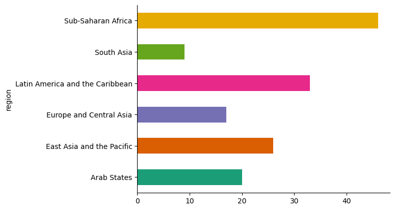
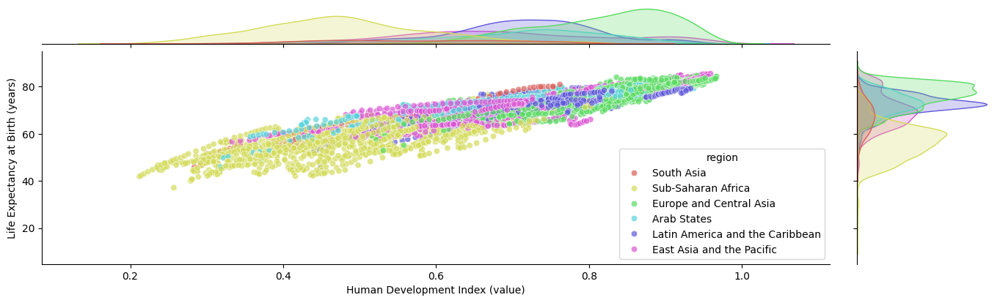
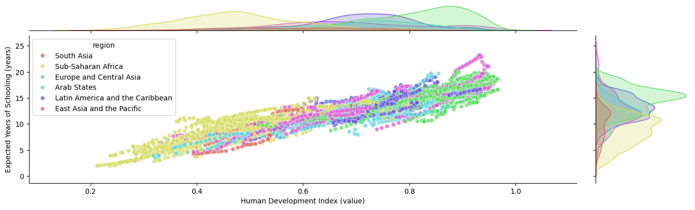
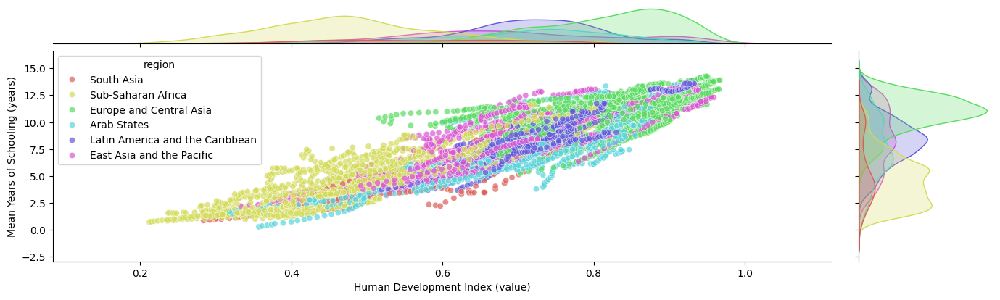
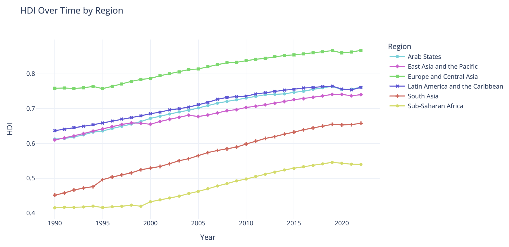
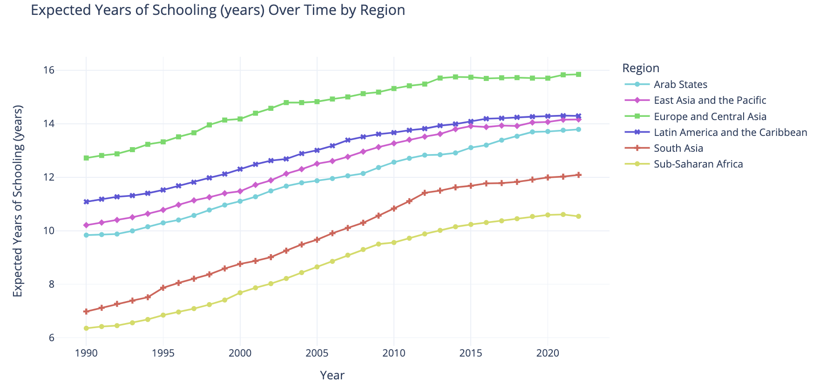

# Human Development Analysis

## Introduction

The Human Development Index (HDI) published yearly since 1990 by the United Nations Development Program (UNDP) is perhaps the most popular index used to assess countries’ well-being levels across the globe. Defined as an average of achievements in health, education and standard of living, its popularity can be attributed to the simplicity of its characterization and to its underlying message that “development is more than economic growth”.

The Human Development Report (HDR) dataset is a comprehensive collection of data related to various aspects of human development across the world. Compiled and published annually by the United Nations Development Programme (UNDP), this dataset provides a wealth of information on key indicators such as life expectancy, education levels, income, and other socioeconomic factors. It covers a wide range of countries and territories, allowing for cross-country comparisons and analysis of trends over time. The dataset can be downloaded from the official HDR data center at the following URL: https://hdr.undp.org/data-center/documentation-and-downloads

## Literature Review

The Human Development Index (HDI) is the geometric mean of normalized indices for each of the three basic dimensions of human development:

- (i) A long and healthy life is assessed by life expectancy (le) at birth
- (ii) Being knowledgeable is measured by mean of years of schooling for adults aged 25 years (mys) and more and expected years of schooling (eys) for children of school entering age.
- (iii) A decent standard of living is measured by gross national income per capita (gnipc).

| Dimension | Indicator | Description | Min | Max |
| --- | --- | --- | --- | --- |
| (i) Health | Life expectancy at birth (le) | Number of years newborn children would live if subject to the mortality risks prevailing for the cross-section of population at the time of their birth. | 14.10 | 86.90 |
| (ii) Education | Expected years of schooling (eys) | Number of years of schooling a child of school entrance age can expect to receive, if prevailing patterns of age-specific enrolment rates persist throughout the child's schooling life | 1.94 | 23.25 |
| (ii) Education | Mean years of schooling of adults aged 25+ (mys) | Average years of schooling for the population aged 25 or more years. | 0.29 | 14.25 |
| (iii) Standard of Living | Gross national income per capita (gnipc) | Sum of value added by all resident producers plus any product taxes (less subsidies) not included in the valuation of output plus net receipts of primary income from abroad | 415 | 146,673 |

The HDI simplifies and captures only part of what human development entails. It does not reflect on inequalities, poverty, human security, empowerment, etc. The HDI is a measure of potential human development and should be used as a reference tool, to contrast with other indices and to monitor changes in human development over time. The HDI can be used to question national policy choices, asking how two countries with the same level of GNI per capita can end up with different human development outcomes. These contrasts can stimulate debate about government policy priorities.

## Methodology

The dataset contains information on the HDI, as well as its components (life expectancy, education, and income), for a wide range of countries and territories. The analysis involved the following steps:

### 1. Data preprocessing
- Reshaping the Data: The dataset was reshaped to facilitate analysis. This involved transforming the data from a wide format to a long format by pivoting for more suitable structure for analysis.
- Region Alignment: UNDP utilizes distinct regional classifications based on development similarities, differing from conventional global or continental divisions. Some regions may be absent in the HDI dataset due to these unique classifications. To ensure comprehensive analysis, external data sources were integrated to include all regions in the study.
  
   

- Grouping by Region and Year: The data was grouped by year and region, and the mean values for each indicator were calculated.

### 2. Analysis Techniques
- Trends Analysis: Analyzed HDI trends over time for different regions and choropleth maps to visualize the geographical distribution of HDI.
   
- Univariate Analysis: Examined the distribution of HDI and its components (life expectancy, expected years of schooling, mean years of scholing and income) across different regions.
   
   
- Bivariate Analysis: Investigated the relationships between HDI and other indicators (life expectancy, expected years of schooling, mean years of scholing and income).
   
   
   
   
  
## Findings

### Human Development Index (HDI)
- The HDI has steadily improved across all regions from 1990 to 2022.
- Europe and Central Asia (ECA) Latin American and Caribbean (LAC), Arab State (SA) and East Asia and the Pacific (EAP) have shown the highest HDI values.
- Sub-Saharan Africa (SSA) has the lowest HDI compared to other regions.
  
### Life Expectancy at Birth (years)
- Life expectancy at birth has increased across all regions from 1990 to 2022.
- ECA has the highest life expectancy at birth, reaching around 78 years by 2020.
- SSA has the lowest life expectancy, though it has improved over time, reaching more than 60 years by 2020, as challenges like infectious diseases and poverty are gradually being addressed.
- All regions saw a sudden decrease in life expectancy in 2020-2021, likely due to the COVID-19 pandemic's impact on these regions. However, it have shown an increase in life expectancy again in 2022 as they recover from the pandemic's effects.
  
  
### Education: Expected Years of Schooling (eys) and Mean Years of Schooling (mys)
- The eys and mys increased across all regions from 1990 to 2022.
- ECA has the highest eys and mys values, at 15.8 and 12.1 respectively, indicating a strong emphasis on education in the region.
- LAC has the second highest eys and mys values, followed by EAP.
- EAP, AS and SA has shown a significant improvement in both eys and mys, but for mys, SA still lags behind EAP and AS more than 3 years.
- SSA has the lowest eys and mys compared to other regions.
  
  

### Gross National Income (GNI) per Capita
- In 2022, ECA has the highest GNI per Capita. LAC is the second highest. SA is the third highest and SSA have the lowest GNI per Capita.
<!-- - In 1990, EAP had the lowest GNI per Capita among the regions. However, starting around the early 2000s, the EAP region's GNI per Capita began to see a marked acceleration in growth. From 2000 to 2020, the red line depicting EAP shows a steep upward trend, indicating a rapid increase in GNI per Capita during this period. And, in 2022 EAP has moved up to the second highest position, showing a significant improvement over time. -->
- The LAC region, in particular, has exhibited fluctuating GNI per Capita values, remaining around the 25,000 mark since 2008.
- In 2019, the GNI per Capita for of all regions experienced decreases. However, these regions then saw a rebound in their GNI per Capita values in the subsequent year, 2020.
  

## Discussion

### Life Expectancy at Birth
- Asian region has grown significantly over the past few decades, especially since the early 2000s. This improvement is largely due to the rapid economic growth and industrialization experienced by many countries in the region, such as Singapore and Hong Kong, China (SAR), in the late 20th and early 21st centuries.
  
  
- By 2020, the EAP and SA region's HDI had approached the levels of ECA, AS and LAC regions. The COVID-19 pandemic could have been a significant factor affecting the HDI trends in these regions:
  - EAP countries were relatively successful in containing the initial COVID-19 outbreak through strict public health measures.
  - In contrast, ECA and LAC regions were hit harder by the pandemic, experiencing significant health and economic impacts.

### Education
- ECA leads in both eys and mys, indicating a well-established education system with strong access and quality, supported by economic development and prosperity.
- Followed by LAC suggesting strong access and quality in education systems.
  
  
- EAP, SA shows significant improvements but still lags in mys, indicating challenges in ensuring high-quality education and completion rates despite improved access.
- SSA lags behind other regions due to insufficient funding and resources, limited access to schools (especially in rural areas), and high dropout rates.
  
  

### GNI per Capita
- While the overall trend has been one of increasing GNI per Capita across most regions, AS, LAC, and SA have faced periods of stagnation or even declines in recent years, in contrast to the more consistent growth seen in other regions like ECA and EAP. 
- The global financial crisis of 2008-2009 had a significant impact on the LAC region, as it is closely integrated with the global economy.
- China and the Asian Tigers (Hong Kong, Singapore, South Korea, and Taiwan) of economic rise and in particular, has been a significant driver of growth in the EAP region, propelling it to become a major economic powerhouse in the global economy.
  
  

## Bibliography

> United Nations Development Programme. (n.d.). All composite indices and components time series (1990-2022). Human Development Data Center. https://hdr.undp.org/data-center/documentation-and-downloads

> Smits, J., & Permanyer, I. (2019). The subnational human development database. Scientific data, 6(1), 1-15.
